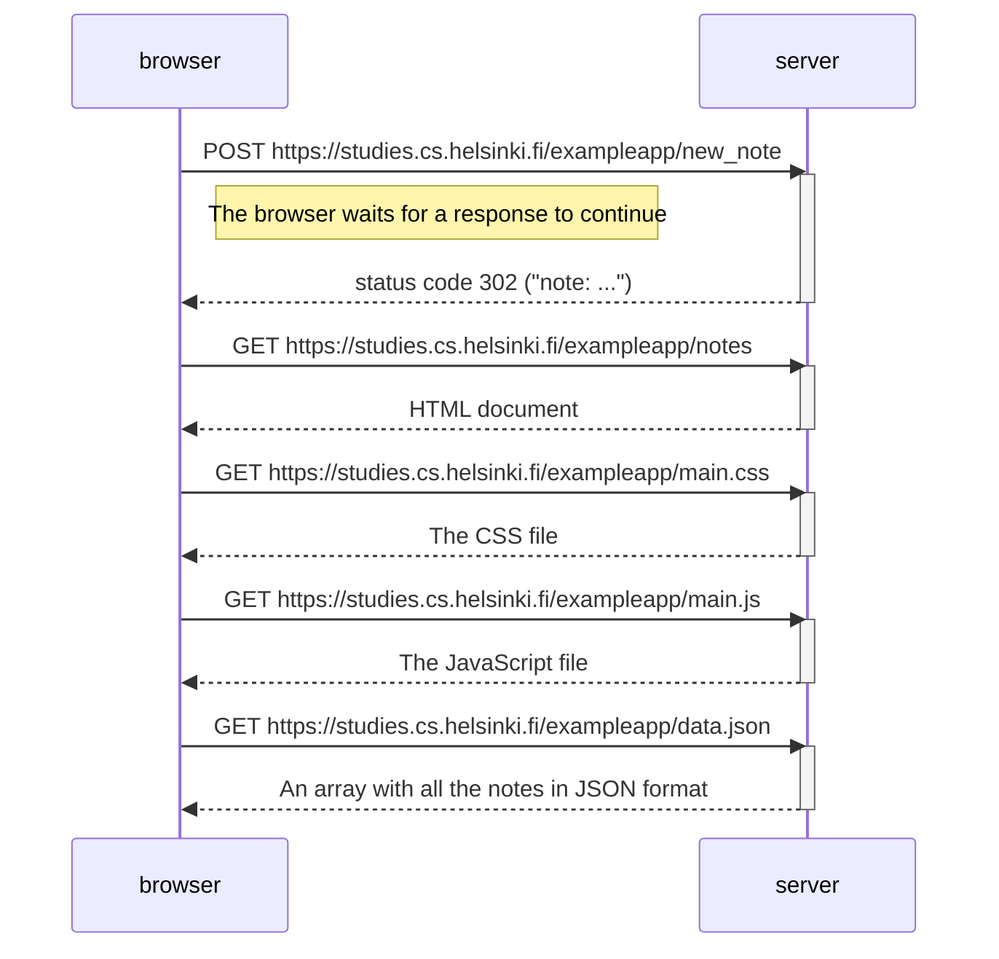

```mermaid
sequenceDiagram
    participant browser
    participant server

        browser->>server: POST https://studies.cs.helsinki.fi/exampleapp/new_note;
        activate server;
        Note right of browser: The browser waits for a response to continue;
        server -->> browser: status code 302 ("note: ...");
        deactivate server;

        browser->>server: GET https://studies.cs.helsinki.fi/exampleapp/notes;
        activate server;
        server-->>browser: HTML document;
        deactivate server;

        browser->>server: GET https://studies.cs.helsinki.fi/exampleapp/main.css;
        activate server;
        server-->>browser: The CSS file;
        deactivate server;

        browser->>server: GET https://studies.cs.helsinki.fi/exampleapp/main.js;
        activate server;
        server-->>browser: The JavaScript file;
        deactivate server;

        browser->>server: GET https://studies.cs.helsinki.fi/exampleapp/data.json;
        activate server;
        server-->>browser: An array with all the notes in JSON format;
        deactivate server;
```

