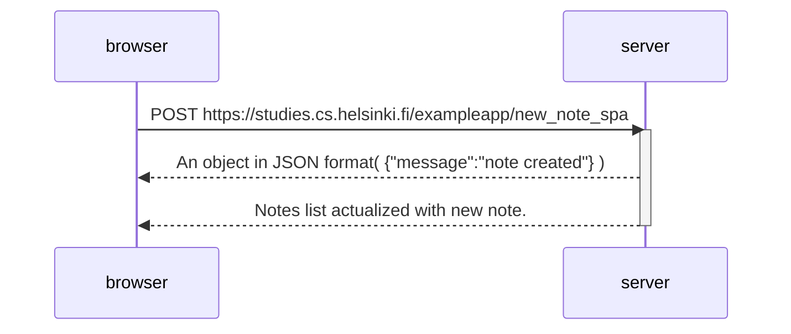

```mermaid
sequenceDiagram
    participant browser
    participant server

        browser->>server: POST https://studies.cs.helsinki.fi/exampleapp/new_note_spa;
        activate server;
        server-->>browser: An object in JSON format( {"message":"note created"} );
        server-->>browser: Notes list actualized with new note.
        deactivate server;
```
